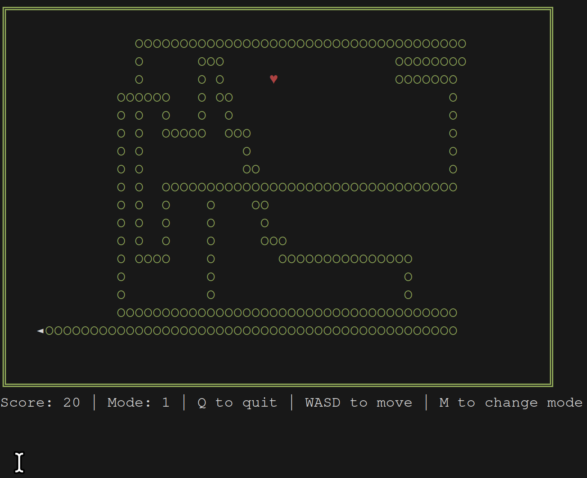
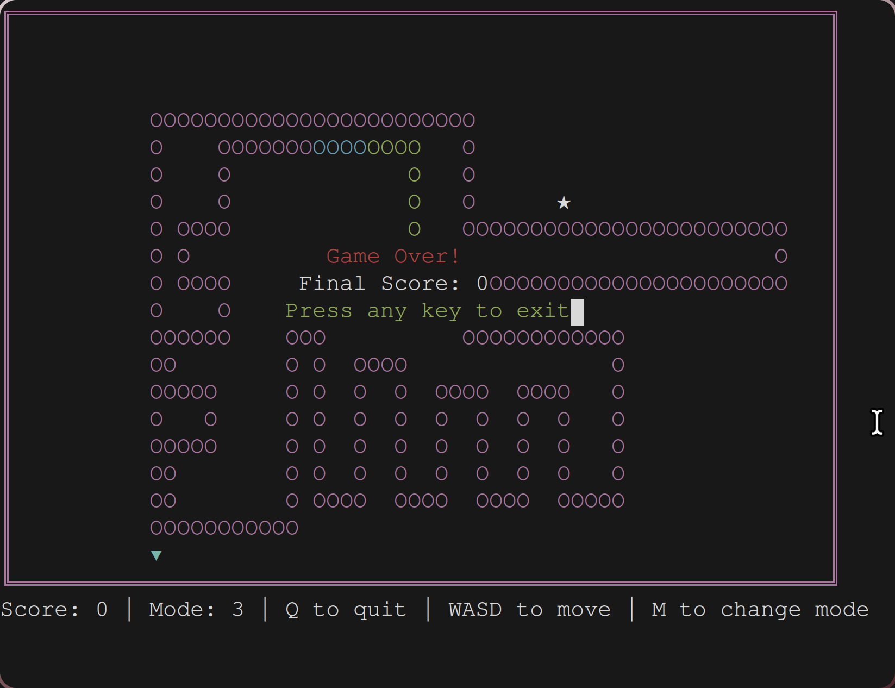
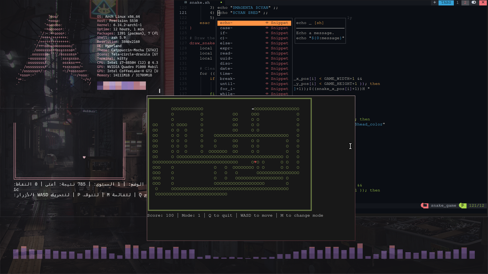

# Snake Game in Bash

<!--  -->

> Powered by **DEXTER** — a colorful terminal-based Snake game with multiple modes, written in Bash!

---

## 🎮 About the Game

This is a terminal version of the classic **Snake** game, implemented in pure Bash. It features:

- 📦 Five different **game modes**, each with unique colors and behaviors
- 🌈 **Rainbow effects**, colorful snake and food characters
- 🧠 Dynamic **difficulty adjustment** as the game progresses
- ⌨️ Intuitive keyboard controls using **WASD** or **arrow keys**
- 🖼️ Clean UI with Unicode borders and symbols

---

## 🚀 Getting Started

### 🧾 Requirements
- Bash (version 4 or higher recommended)
- A Unix-like terminal (e.g. Linux, macOS, or WSL)
- `tput` and ANSI escape sequence support

 Clone this repository:
```bash
git clone https://github.com/abod8639/bash_snake_game.git
cd snake_game
```

### ▶️ Run the Game
```bash
chmod +x snake.sh
./snake.sh
```

<!-- > 💡 For best experience, maximize your terminal window. -->

---

## 🎮 Controls
| Key | Action          |
|-----|-----------------|
| `W` / `↑` | Move Up          |
| `S` / `↓` | Move Down        |
| `A` / `←` | Move Left        |
| `D` / `→` | Move Right       |
| `M`       | Change Game Mode |
| `Q`       | Quit Game        |

---

## 🧪 Game Modes
| Mode | Description           | Border  | Snake         | Food        |
|------|-----------------------|---------|---------------|-------------|
| 1    | Classic (Normal)      | Green   | Green & White | Red ♥       |
| 2    | Fast Speed            | Blue    | Blue & Yellow | Yellow ♦    |
| 3    | Slow Speed            | Magenta | Magenta & Cyan| White ★     |
| 4    | Wraparound            | Cyan    | Cyan & Red    | Green ●     |
| 5    | Rainbow (chaotic fun)| Yellow  | 🌈 Rainbow     | ✿ Random    |

> Each mode provides a fresh visual and gameplay experience.


---

## 📷 Screenshots


<!-- (images/250417_20h49m46s_screenshot.png) -->







---

## 🧹 Cleanup
The script ensures your terminal settings (e.g. echo, cursor) are reset even after exiting with Ctrl+C.

---

## 🧑‍💻 Author
**Dexter** — follow for more terminal experiments and Bash wizardry!

---

## 📜 License
MIT License. Use, share, and modify freely.
